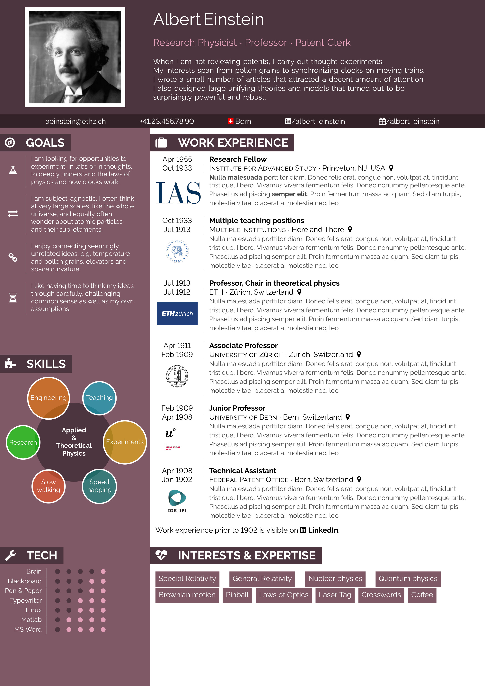

# Einstein CV Template
## TL;DR
This template requires LaTeX[^1].

With very little pain, it should let you...
* pick the colors of your liking
* remove/change the icons
* resize the header/contact band/page columns as you see fit
* move sections around
* write your content on multiple pages[^2]

## Important warning
The layout was optimized for screenview only, i.e. **it comes with no page margins**. If printed, the absence of margins will mess everything. You have been warned.

## Example
Take a look at the samples placed in [examples/](examples/) and decide whether this template is a good starting point for you or not.

## How to customize the CV to your taste
### Colors
You'll most certainly want to chose different colors for the header, contact band and left column. To do so, open [cv_einstein.cls](cv_einstein.cls).

Tools such as [HSB Color Picker](https://codepen.io/HunorMarton/details/eWvewo) will help you find a suitable hue, saturation and brightness. The only caveat is that the template takes hue values between [0;1] while most online color pickers display hues in [0; 255] or [0; 360] ranges. You'll have to do some maths.

### Icons
All icons come from Font Awesome for LaTeX, whose documentation is available at [doc/fontawesome.pdf](doc/fontawesome.pdf).

### Layout
Rearranging the layout and the visual elements should also be pretty straightforward, as the template doesn't use any fancy package beyond [paracol](https://www.ctan.org/pkg/paracol) and [tikz](https://tikz.net/).

You'll see some negative `\hspace{}` and `\vspace{}` here and there to keep things aligned, but resizing and moving things around shouldn't give you headaches.

Having said that...

## Request
This template can be improved in many ways, from code quality to visual design. If you make a fork with your own ideas, please be kind and share your version back on [Overleaf](https://www.overleaf.com/), where I drew most of my inspiration from, as a way to thank the community.

I hope this template will make your job search successful!

ML

[^1]: If you don't know what LaTeX is, then you should probably not invest your time learning it now in the middle of your job search. However, if want to give it a try, I recommend using [Overleaf](https://www.overleaf.com) which offers a very decent user experience even with their free plan. Actually, this CV template is available in [Overleaf's public gallery](https://www.overleaf.com/latex/templates?q=CV+einstein) among many other templates I drew inspiration from.
[^2]: You would be surprised how many popular templates break as soon as you need your CV to be 2 pages or more.
